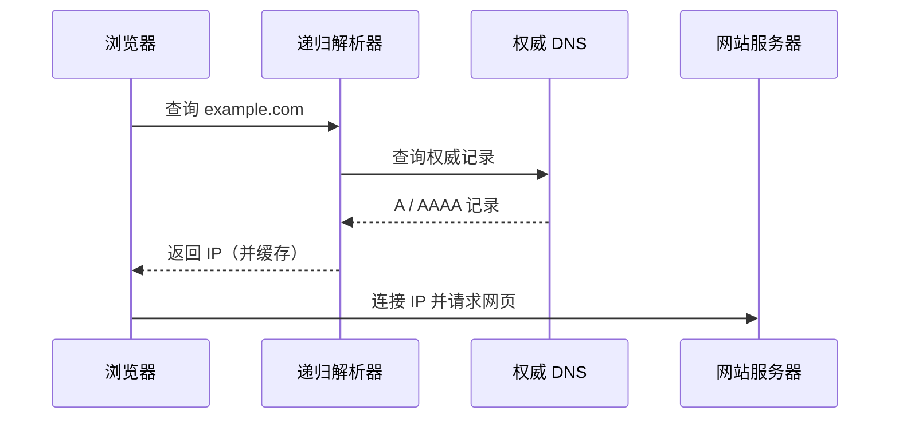

# DNS以及它是如何工作的

> [!abstract] 一句话
> DNS（域名系统）像互联网的电话簿：把人类可读的域名解析为设备通信所需的 IP 地址。

## 核心概念

| 角色 / 记录      | 职责                  |
| ------------ | ------------------- |
| 递归解析器        | 代替客户端逐级查询，并缓存结果     |
| 根、TLD DNS    | 将查询引导到对应顶级域和权威服务器   |
| 权威 DNS       | 保存某个域名最终、可信的解析记录    |
| `A` / `AAAA` | 分别返回 IPv4 / IPv6 地址 |
| `CNAME`      | 将域名别名指向另一个域名        |
| TTL          | 解析结果可缓存的时长          |

## 工作过程

1. 浏览器、操作系统与递归解析器依次检查缓存。
2. 未命中时，递归解析器经根域、顶级域找到目标域名的权威 DNS。
3. 权威 DNS 返回相应记录；解析器按 TTL 缓存并返回给客户端。
4. 浏览器用获得的 IP 建立连接，开始 HTTP(S) 通信。

> [!warning] 常见问题
> DNS 变更不是立即全球生效：旧记录会在各级缓存中保留到 TTL 到期。排查时还需确认记录类型、权威服务器和本地缓存。

## 关联笔记

- [[什么是域名]]、[[什么是主机]]
- [[互联网是如何运作的]]、[[什么是HTTP]]、[[浏览器及其工作原理]]
