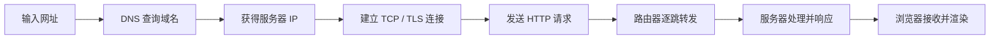

# 互联网是如何运作的

> [!abstract] 一句话
> 互联网是由大量自治网络互联而成的全球网络，数据被拆成数据包，经路由器逐跳转发到目标主机。

## 核心概念

- **IP 地址**：网络中主机的逻辑地址，用于定位目的地。
- **数据包**：传输数据的基本单位；每个包都携带源、目的地址等控制信息。
- **路由器**：依据路由表选择下一跳，把数据包转发到更接近目的地的网络。
- **协议栈**：不同层各司其职：IP 负责寻址与转发，TCP/UDP 负责端到端传输，HTTP 等负责应用语义。

## 工作过程

1. 域名先通过 [[DNS以及它是如何工作的|DNS]] 解析为 IP 地址。
2. 客户端与服务器建立传输连接；HTTPS 还会进行 TLS 握手。
3. 请求和响应被拆成多个数据包，在运营商与骨干网络之间转发。
4. 接收端校验、重组数据后交给上层应用处理；TCP 可处理丢包与乱序。

> [!tip] 理解重点
> IP 解决“**发往哪里**”，路由解决“**下一跳怎么走**”，TCP/UDP 解决“**怎样送达**”，HTTP 解决“**传什么、如何表达**”。

## 关联笔记

- [[互联网]]、[[什么是主机]]、[[什么是域名]]
- [[DNS以及它是如何工作的]]、[[什么是HTTP]]、[[浏览器及其工作原理]]
