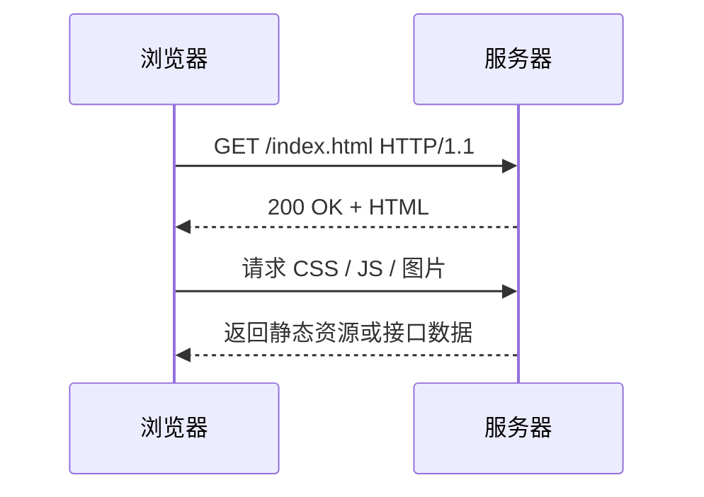

# 什么是HTTP

> [!abstract] 一句话
> HTTP（超文本传输协议）定义了客户端与服务器如何以“请求—响应”方式交换 Web 资源。

## 核心概念

| 概念 | 说明 |
| --- | --- |
| 请求 | 方法、URL、请求头、可选请求体 |
| 响应 | 状态码、响应头、响应体 |
| 无状态 | 每次请求独立；登录状态通常借助 Cookie、Token 等维持 |
| HTTPS | HTTP + TLS，加密传输并验证服务端身份 |

常见方法：`GET` 读取、`POST` 创建或提交、`PUT/PATCH` 更新、`DELETE` 删除。

## 工作过程

1. 浏览器通过 URL 找到服务器并建立连接。
2. 发送 HTTP 请求，携带方法、路径、头部及必要数据。
3. 服务器处理请求，返回状态码与资源数据。
4. 浏览器根据响应继续加载资源、渲染页面或展示错误。

| 状态码 | 含义 |
| --- | --- |
| `2xx` | 请求成功，如 `200 OK` |
| `3xx` | 重定向，如 `301`、`302` |
| `4xx` | 客户端错误，如 `404`、`401` |
| `5xx` | 服务器错误，如 `500`、`502` |

> [!tip] 实践要点
> 使用 HTTPS；合理设置缓存头（如 `Cache-Control`）；接口保持清晰的状态码、数据结构与错误信息。

## 关联笔记

- [[互联网是如何运作的]]、[[什么是域名]]
- [[DNS以及它是如何工作的]]、[[浏览器及其工作原理]]
