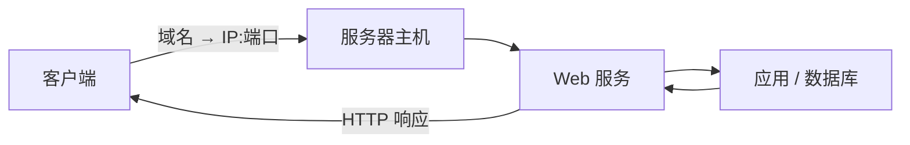

# 什么是主机

> [!abstract] 一句话
> 主机（Host）是接入网络、拥有 IP 地址并能提供或使用网络服务的设备或运行环境。

## 核心概念

- **客户端主机**：发起请求的一方，例如电脑、手机或浏览器所在设备。
- **服务器主机**：对外提供网站、接口、文件或数据库等服务的主机。
- **IP 地址**：主机在网络中的通信地址；公网 IP 可被互联网路由，私网 IP 仅在局域网使用。
- **端口**：区分同一主机上的不同网络服务，例如 HTTP 常用 `80`、HTTPS 常用 `443`。

> [!note]
> “主机”既可指一台物理设备，也可指虚拟机、容器或云服务器实例。

## 工作过程

1. 客户端通过 [[什么是域名|域名]] 和 [[DNS以及它是如何工作的|DNS]] 找到目标主机的 IP。
2. 连接到目标 IP 的特定端口。
3. 操作系统将网络数据交给监听该端口的服务进程。
4. 服务处理请求并返回结果。

## 关联笔记

- [[互联网是如何运作的]]、[[什么是域名]]
- [[DNS以及它是如何工作的]]、[[什么是HTTP]]
