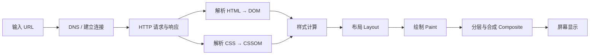

# 浏览器及其工作原理

> [!abstract] 一句话
> 浏览器把 URL 对应的网络资源获取下来，解析为页面结构与样式，再经布局、绘制和合成，最终显示在屏幕上。

## 核心概念

| 模块     | 职责                                |
| ------ | --------------------------------- |
| 用户界面   | 地址栏、标签页、前进/后退等交互                  |
| 浏览器进程  | 管理窗口、权限、网络请求与其他进程                 |
| 渲染进程   | 解析 HTML/CSS、执行 JavaScript、生成并绘制页面 |
| 网络进程   | DNS 解析、连接建立、HTTP(S) 数据传输与缓存       |
| GPU 进程 | 图层合成与部分图形加速                       |

现代浏览器通常采用**多进程架构**：一个标签页或站点出现故障时，尽量不影响其他页面；代价是内存占用更高。

## 页面加载流程

1. **导航**：浏览器检查缓存、解析域名，建立 TCP + TLS（HTTPS）连接后发起 HTTP 请求。
2. **解析**：HTML 被逐步解析为 DOM；CSS 形成 CSSOM；两者用于计算元素最终样式。
3. **JavaScript**：脚本可读写 DOM/CSSOM。普通 `<script>` 会阻塞 HTML 解析；`defer` 在解析完成后执行，`async` 下载完即执行。
4. **渲染**：浏览器构建渲染树，确定元素几何位置（布局），再绘制文本、颜色、边框等像素。
5. **合成**：页面图层交给 GPU 合成并显示。滚动、`transform`、`opacity` 等变化通常更容易避免重新布局与绘制。

> [!tip] 性能关键
> 减少关键资源、压缩与缓存静态文件；避免频繁读写会触发布局的属性；优先使用 `transform` 和 `opacity` 制作动画。

## 关键术语

- **DOM**：HTML 解析出的文档树。
- **CSSOM**：CSS 解析出的样式规则树。
- **重排（Reflow / Layout）**：元素尺寸或位置变化后重新计算布局，成本较高。
- **重绘（Repaint）**：外观变化但不影响布局时重新绘制。
- **合成（Composite）**：将多个图层组合成最终画面。
- **同源策略**：限制不同源页面间的资源与数据访问；跨域通常通过 CORS 等机制处理。

## 关联笔记

- [[互联网]]、[[互联网是如何运作的]]
- [[DNS以及它是如何工作的]]
- [[什么是HTTP]]
- [[什么是域名]]
